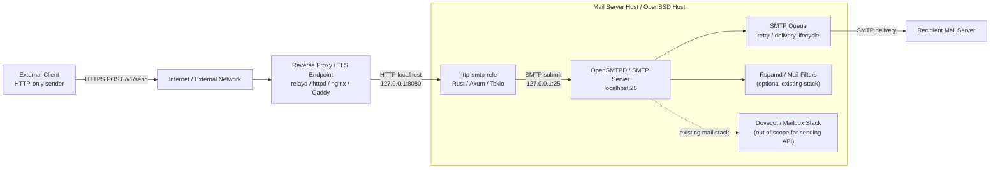
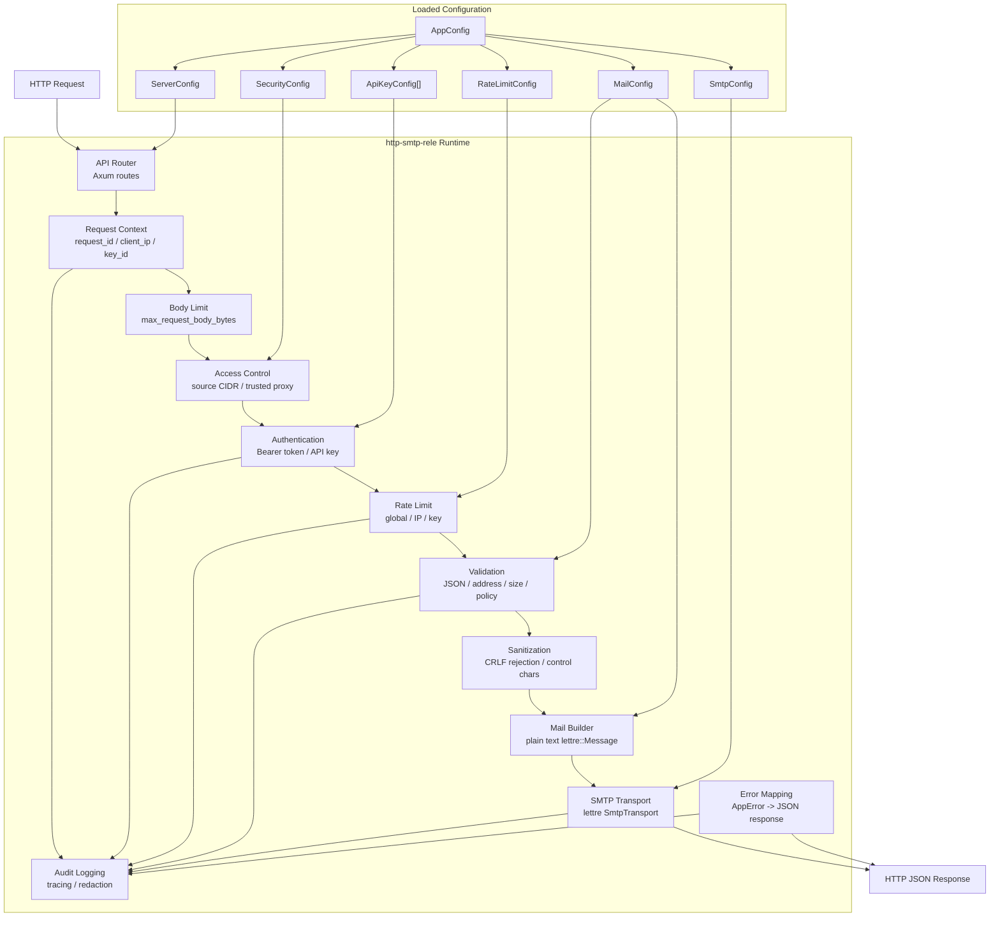
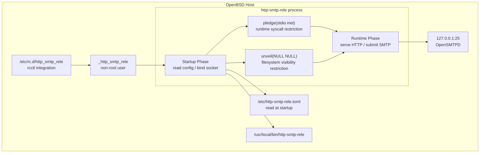
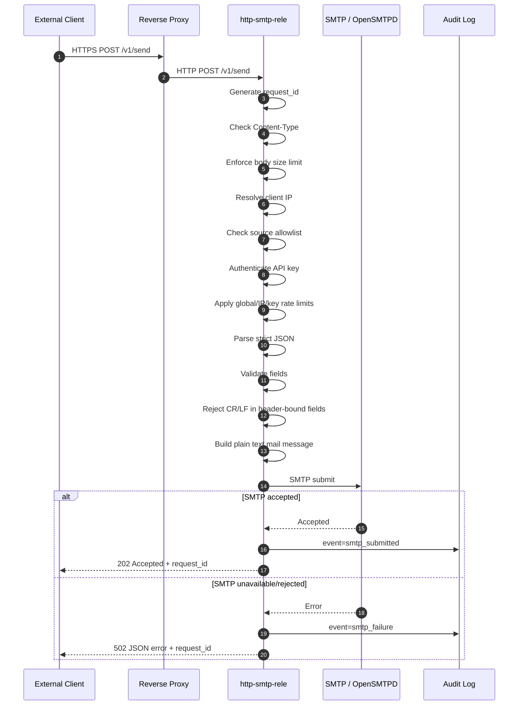
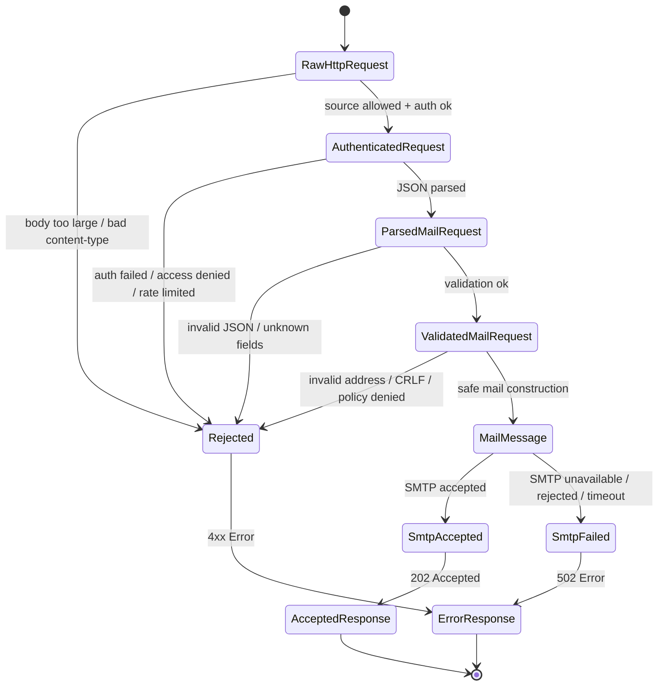
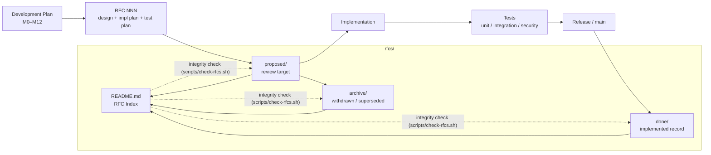
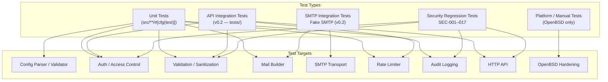

# Architecture

## 1. System Architecture

The relay is an HTTP submission gate between application clients and a local SMTP server.
TLS termination and external access control are delegated to the reverse proxy layer.



`http-smtp-rele` is not a replacement for OpenSMTPD — it adds an authenticated, validated
HTTP submission path to an existing SMTP infrastructure. Queue management and delivery retry
remain with the MTA.

---

## 2. Runtime Component Architecture



> **Implementation note:** In the current codebase, the "Access Control" step (source CIDR
> allowlist) and "Authentication" are combined inside the `AuthContext` Axum extractor
> (`src/auth.rs`), not as separate Tower middleware layers. The diagram shows the logical
> responsibility split; the physical split is auth extractor handles both.

---

## 3. Security Boundary Architecture

```mermaid
flowchart LR
    subgraph Untrusted["Untrusted Zone"]
        Client["External Client"]
        SpoofedHeaders["Potentially spoofed headers<br/>X-Forwarded-For etc."]
    end

    subgraph Edge["Edge / Reverse Proxy Zone"]
        TLS["TLS Termination"]
        ProxyAccess["Optional IP Allowlist<br/>mTLS / method limit"]
        Forwarded["Trusted Forwarded Headers"]
    end

    subgraph AppBoundary["http-smtp-rele Trust Boundary"]
        ResolveIP["Client IP Resolution"]
        Allowlist["Source CIDR Allowlist"]
        Auth["API Key Authentication"]
        Limit["Rate Limit"]
        Validate["Strict Validation"]
        Reject["Reject Unsafe Input"]
        Build["Safe Message Construction"]
    end

    subgraph LocalTrusted["Local Trusted Mail Zone"]
        SMTP["OpenSMTPD localhost:25"]
        Queue["SMTP Queue"]
    end

    Client --> TLS
    SpoofedHeaders -. "ignored unless proxy is trusted" .-> ResolveIP
    TLS --> ProxyAccess --> Forwarded --> ResolveIP
    ResolveIP --> Allowlist --> Auth --> Limit --> Validate
    Validate --> Reject
    Validate --> Build --> SMTP --> Queue
    Reject --> Error["Safe JSON Error<br/>no secret / no body"]
```



`X-Forwarded-For` is trusted only when the socket peer IP is in `security.trusted_source_cidrs`.

---

## 4. OpenBSD Hardening Architecture



`unveil` is applied before `pledge`. After `unveil(NULL, NULL)`, no filesystem access is
possible. The config is fully loaded before this point. `smtp.host` must be an IP address
(`127.0.0.1`), not a hostname, because the `dns` pledge promise is not included.

---

## 5. Request Processing Flow



`request_id` is generated at step 1 and included in all subsequent log events, the success
response, and all error responses.

---

## 6. Domain Concept Model

Reflects the confirmed MVP schema agreed with the architect.

```mermaid
classDiagram
    class AppConfig {
        ServerConfig server
        SecurityConfig security
        RateLimitConfig rate_limit
        MailConfig mail
        SmtpConfig smtp
        LoggingConfig logging
    }

    class ServerConfig {
        String bind_address
        usize max_request_body_bytes
        u64 request_timeout_seconds
        u64 shutdown_timeout_seconds
    }

    class SecurityConfig {
        bool require_auth
        bool trust_proxy_headers
        CIDR[] trusted_source_cidrs
        CIDR[] allowed_source_cidrs
        ApiKeyConfig[] api_keys
    }

    class RateLimitConfig {
        u32 global_per_min
        u32 per_ip_per_min
        u32 burst_size
    }

    class MailConfig {
        String default_from
        String default_from_name
        Domain[] allowed_recipient_domains
        usize max_subject_chars
        usize max_body_bytes
    }

    class SmtpConfig {
        String mode
        String host
        u16 port
        u64 connect_timeout_seconds
        u64 submission_timeout_seconds
    }

    class ApiKeyConfig {
        String id
        SecretString secret
        bool enabled
        Domain[] allowed_recipient_domains
        u32 rate_limit_per_min
    }

    class RequestContext {
        RequestId request_id
        IpAddr client_ip
        String key_id
        Instant started_at
    }

    class MailRequest {
        String to
        String subject
        String body
        String from_name
        String reply_to
        Object metadata
    }

    class ValidatedMailRequest {
        String to
        String subject
        String body
        String from_name
        String reply_to
        String client_request_id
    }

    AppConfig *-- ServerConfig
    AppConfig *-- SecurityConfig
    AppConfig *-- RateLimitConfig
    AppConfig *-- MailConfig
    AppConfig *-- SmtpConfig
    AppConfig *-- ApiKeyConfig

    ApiKeyConfig --> RequestContext : id is emitted as key_id in logs
    note for LoggingConfig "format, level, mask_recipient"
    MailRequest --> ValidatedMailRequest : validate_mail_request()
    ValidatedMailRequest --> "lettre::Message" : mail::build_message()
    "lettre::Message" --> "202 Accepted" : smtp::submit()
```

**`trusted_source_cidrs` vs. `allowed_source_cidrs`:**
- `trusted_source_cidrs` — CIDRs whose `X-Forwarded-For` headers may be trusted for client
  IP resolution. Applies only when `trust_proxy_headers = true`.
- `allowed_source_cidrs` — CIDRs from which connections are permitted at all (empty = allow
  all source IPs). Applied after IP resolution; independent of proxy header trust.

**`id` vs. `key_id`:**
In TOML the field is `id` (scoped under `[[api_keys]]`). In logs and `RequestContext` the
same value is emitted as `key_id` to avoid ambiguity in log output.

**Conceptual types in `ValidatedMailRequest`:**
Fields are `String` in the implementation, with type safety enforced by a private constructor
in `validation.rs`. `ValidatedMailRequest` can only be produced by `validate_mail_request()`.

**`smtp.mode`:**
Only `"smtp"` is supported in MVP. `"pipe"` is a reserved value that causes immediate startup
failure (RFC 064 deferred). Do not use `"pipe"` until a future RFC implements it.

---

## 7. Data Lifecycle State Machine



The system is **fail-closed**: any unsafe, unknown, unauthenticated, over-limit, or invalid
condition stops processing before SMTP contact.

---

## 8. RFC Lifecycle



---

## 9. Test Architecture



Security regression tests (`SEC-001` through `SEC-017`) are permanent fixtures — they cover
every named security control. See [testing.md](testing.md) for the full list.

---

## Module Map

```
src/
├── main.rs          — CLI arg parsing; startup sequence
├── lib.rs           — AppState; module declarations
│
├── config.rs        — TOML config schema, loading, fail-fast validation
├── error.rs         — AppError enum with IntoResponse; all HTTP error mapping
├── logging.rs       — tracing-subscriber initialization
├── security.rs      — OpenBSD pledge/unveil wrappers (no-op on other platforms)
│
├── auth.rs          — API key extraction, constant-time comparison, AuthContext extractor
├── policy.rs        — Recipient domain policy lookup helpers
├── sanitize.rs      — CR/LF detection (contains_header_injection)
├── validation.rs    — validate_mail_request → ValidatedMailRequest
│
├── rate_limit.rs    — Three-tier token bucket rate limiter
├── mail.rs          — build_message (lettre typed builder, never raw strings)
├── smtp.rs          — SMTP transport init, submit, TCP probe
│
├── api/
│   ├── mod.rs       — Router construction, Tower middleware layers
│   ├── send.rs      — POST /v1/send handler; per-key rate limit; pipeline wiring
│   └── health.rs    — GET /healthz and /readyz handlers
│
└── tests.rs         — Integration test stubs (expanded in v0.2)
```


---

## Design Review Notes

All discrepancies between the architect's initial diagrams and the implementation have been
resolved. The following table is the final record of each decision.

| ID | Item | Resolution |
|----|------|-----------|
| D-01 | CIDR placement | `trusted_source_cidrs` and `allowed_source_cidrs` both live in `[security]`. `[server]` has no CIDR fields. |
| D-02 | `concurrency_limit` | Deferred to v0.2. Not in MVP schema. |
| D-03 | `reject_raw_headers`, `allow_multiple_recipients` | Not config fields. Header rejection is always-on (RFC 051); multi-recipient deferred (RFC 064 scope). |
| D-04 | Proxy header flag name | `trust_proxy_headers` confirmed. |
| D-05 | Rate limit burst granularity | Shared `burst_size` confirmed for MVP. Per-tier burst deferred to v0.2. |
| D-06 | Key identifier naming | TOML field: `id`. Log/context field: `key_id`. Both correct. |
| D-07 | Per-address recipient allowlist | Deferred to v0.2. MVP: domain-level only. |
| D-08 | Per-key burst override | Deferred with D-05. |
| D-09 | `SmtpMode` enum | `String` field confirmed. `"pipe"` fails at startup (RFC 064). |
| D-10 | Access Control / Auth split | Logical separation correct in diagram. Physical implementation combines them in `AuthContext` extractor. |
| D-11 | `ValidatedMailRequest` types | `String` fields with private constructor confirmed (RFC 050). |
